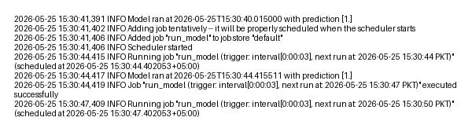

# APScheduler MLOps Job

This project utilises APScheduler and runs a model once on startup, then keeps the same job on a daily cron schedule. If the model file is missing, the job still writes a run log.

## What it includes

- startup execution plus daily cron scheduling
- configurable model and log paths
- optional sample input for `predict`
- file-based run logging

## Layout

- `main.py`
- `apscheduler_ml_job/job.py`
This repository demonstrates scheduling a machine-learning model run with APScheduler.

Key behaviors:
- Runs the model once on startup (logs the result).
- Schedules a follow-up job using APScheduler (cron, interval, or one-time `date` trigger).
- Writes run entries to a file under `logs/`.

Project layout
- `main.py` — CLI entrypoint and scheduler bootstrap.
- `apscheduler_ml_job/job.py` — model runner and logging.
- `apscheduler_ml_job/scheduler.py` — helper to build scheduler triggers.
- `scripts/generate_model.py` — convenience script to create a demo `model.pkl`.
- `requirements.txt` — runtime dependencies.

Quickstart
1. Create a virtualenv and install deps:

```powershell
python -m venv .venv
.venv\Scripts\activate
pip install -r requirements.txt
pip install pillow
```

2. (Optional) Create a demo model used by the example:

```powershell
python scripts/generate_model.py
```

3. Run the project:

- Run once now and schedule a daily cron-like job (default):

```powershell
python main.py --model-path model.pkl --log-path logs/model_runs.log --hour 8 --minute 0 --second 0
```

- Schedule a one-time run at an exact future timestamp (useful for demos):

```powershell
python main.py --run-at 2026-05-25T14:59:01 --log-path logs/model_runs.log
```

- Schedule a repeating demo interval (every 5 seconds):

```powershell
python main.py --interval-seconds 5 --log-path logs/model_runs.log
```

Logs
- Run entries are appended to the file passed with `--log-path` (default `logs/model_runs.log`).

Example run (terminal)

```powershell
PS C:\Users\muzam\Desktop\to do\projects to take care of\rems\other\APScheduler and Cron Job Scheduling for Model Automation> python scripts/generate_model.py
Saved demo model to C:\Users\muzam\Desktop\to do\projects to take care of\rems\other\APScheduler and Cron Job Scheduling for Model Automation\model.pkl
PS C:\Users\muzam\Desktop\to do\projects to take care of\rems\other\APScheduler and Cron Job Scheduling for Model Automation> python main.py --interval-seconds 3 --log-path logs/model_runs.log
2026-05-25 15:30:41,391 INFO Model ran at 2026-05-25T15:30:40.015000 with prediction [1.]
2026-05-25 15:30:41,402 INFO Adding job tentatively -- it will be properly scheduled when the scheduler starts
2026-05-25 15:30:41,406 INFO Added job "run_model" to job store "default"
2026-05-25 15:30:41,406 INFO Scheduler started
2026-05-25 15:30:44,415 INFO Running job "run_model (trigger: interval[0:00:03], next run at: 2026-05-25 15:30:44 PKT)" (scheduled at 2026-05-25 15:30:44.402053+05:00)
2026-05-25 15:30:44,417 INFO Model ran at 2026-05-25T15:30:44.415511 with prediction [1.]
2026-05-25 15:30:44,419 INFO Job "run_model (trigger: interval[0:00:03], next run at: 2026-05-25 15:30:47 PKT)" executed successfully
2026-05-25 15:30:47,409 INFO Running job "run_model (trigger: interval[0:00:03], next run at: 2026-05-25 15:30:50 PKT)" (scheduled at 2026-05-25 15:30:47.402053+05:00)
```

Screenshot (terminal run)



Notes
- The project is intentionally minimal and demonstrates scheduling patterns; adapt `run_model` to load and run your real model.
- `BlockingScheduler` keeps the process running; use a different scheduler for non-blocking/in-process use.

If you'd like, I can remove `assets/screenshots/terminal_run.png` as well or replace it with a prettier terminal-style capture — tell me which you prefer.
